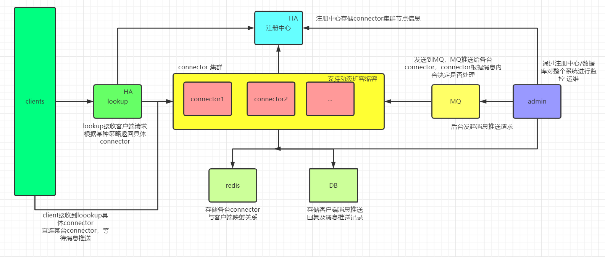

# distributed-message-push-system

- 分布式消息推送系统

V0.1 架构:

v0.2（未来）:

## 前言

该项目的前身：<https://github.com/0xcaffebabe/seeaw4>

项目前身是一个支持多端的跨平台控制软件 本质上是通过网络消息推送与接收来实现各种PC/手机控制功能

网络编程和 Web 都是 Java 的拿手好戏, 而各种业务系统我已经写了不少了, 这些系统都基于 Web, 该类系统的复杂在于业务逻辑, 至于实现技术, 都是大同小异的.

于是我想做一个更为纯粹“技术系统”, 我将之前的远控软件中这个通用的 消息推送/接收功能 抽取出来, 加之以一些并不存在的需求(高可用 可扩展 支撑用户数大) 成为一个分布式消息推送系统 就是这个项目了. 

## 预期的应用场景

开发的这个系统 本意是想可以嵌入其他系统 称为其他系统的子系统 目前的假设：

- IM 消息推送
- app 通知推送
- IoT 终端状态上报及事件推送
- ...

## 客户端支持语言

- java
- python
- node
- go(待办)

## 技术栈

- 注册中心:nacos
- 负载均衡：spring cloud ribbon
- 开发框架：spring boot
- 网络框架：netty
- mq：rabbitmq
- 数据库：
    - redis
    - mysql

## 已支持的功能

admin：

- 消息推送
- 消息推送记录

connector：

- 推送消息
    - 单用户
    - 广播
- 推送记录
- 推送确认
- 监控
    - 健康监控
    - 在线用户
        - 踢出用户

lookup:

- connector负载均衡

## 待办

监控：

- lookup调度日志

运维：

- connector扩容缩容

安全：

- 客户端认证
- 消息传输加密